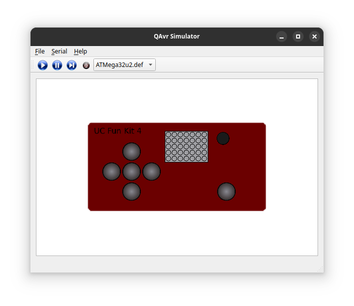

# QAvrSimulator

This is an Atmega AVR simulator with a front end user interface that emulates the UCFunkit4 used in the ENCE260 course at the University of Canterbury NZ.



## Key Features:
- Plugin framework for adding extra features and hardware
- Graphical interface for input and output
- Debug window to see what is happeing in the simulated chip
- Runs AVR ihex files by way of assembly simulator

## Building

Install qt5 tools
- Ubuntu: ```sudo apt install -y qtcreator qtbase5-dev qt5-qmake cmake```

From the repository root run the following commands

```
mkdir build
cd ./build
qmake ../QAvrSimulator.pro
make
```

	
## Running
- Copy the "*.def" files from the ./plugins folder into ./build/QAvrSimulator/plugins/
- From the ./build/QAvrSimulator folder run ./QAvrSimulator

## Using virtual serial ports to connect two instances of the program

QAvrSimulator can connect to your systems serial ports and can run programs that support the AVR Uart.
If you want to connect two instances of the QAvrSimulator using simulated serial, create pair of virtual serail ports using the following command:

```socat -d -d pty,raw,echo=0 pty,raw,echo=0```

Which will start and produce output something like:

```
2013/11/01 13:47:27 socat[2506] N PTY is /dev/pts/<x>
2013/11/01 13:47:27 socat[2506] N PTY is /dev/pts/<y>
2013/11/01 13:47:27 socat[2506] N starting data transfer loop with FDs [3,3] and [5,5]
```

In the QAvrSimulator serial connection list, connect one instance of the simulator to /dev/pts/<x> and the other to /dev/pts/<y> (replace x,y with the numbers reported by socat on your system).

The two instances of QAvrSimulator should be able to communicate with each other.


## Current Hardware support
AVR hardware devices are supported as plugins and currently the following exist:

- Avr_Timer_16B (16 bit timer)
- Avr_Timer_8B (8 bit timer)
- Avr_Uart (Uart)

The hardware support is limited and some functions will not be present.

## About this project

QAvrSimulator was created over 10 years ago when I was a second year computer science student at Canterbury University for the ENCE260 embedded software course.

It's sole purpose at the time was to learn more about how the Ateml AVR 8 bit processors function and maybe produce a tool that could be used by other students.

That was over ten years ago now, and I have no intention of doing further development on it. So it is very much presented here "as is".
